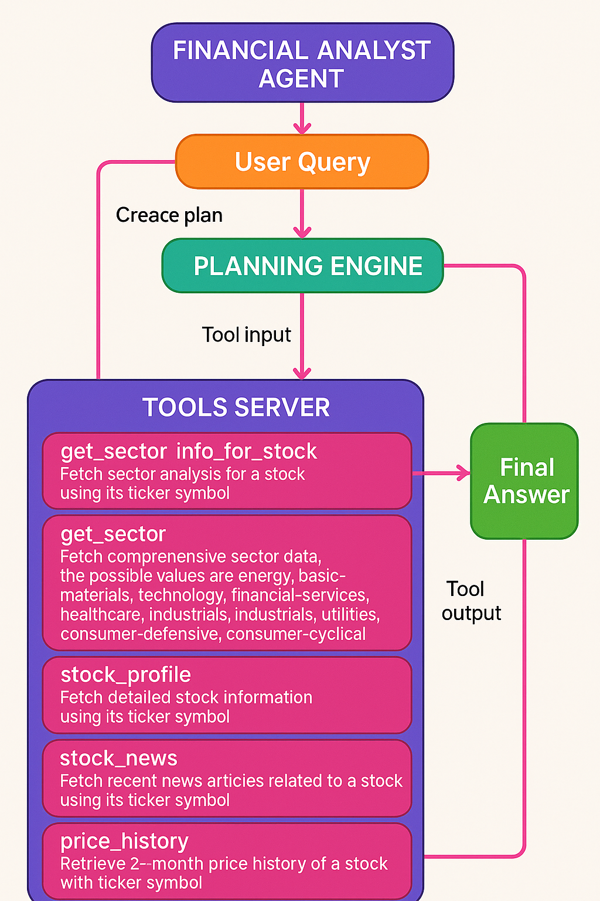

# FinPilot


FinPilot is a modular AI-driven assistant built using the [LlamaIndex](https://gpt-index.readthedocs.io/) library. It leverages a **Structured Planner Agent** to interact with tools and execute tasks. The project also includes an MCP (Model Context Protocol) server for managing tool specifications.

---

## 🔧 Setup

```bash
git clone <repo-url>
pip install --upgrade pip
pip install uv
echo 'OPENAI_API_KEY="xyz"' > .env
uv sync  # (if using Python 3.10 virtualenv)
source .venv/bin/activate  # activate the virtual environment
```

---

## 🧠 Components

### MCP Server

The MCP server provides tool specifications and handles tool-related queries. Built with the `mcp[cli]` package.

### Agent

The `agent.py` script launches a **Structured Planner Agent** using:
- 🛠️ Tools: Loaded from the MCP server
- 🧠 LLM: OpenAI's GPT-4o
- 📜 Prompts: Custom planning instructions

### Run MCP Server

```bash
uv run --active server.py
# MCP inspector:
mcp dev server.py
```

### Run the Agent

```bash
python agent.py
```

---

## 📦 Project Structure

```
finbot/
├── agent.py
├── prompts.py
├── requirements.txt
├── .env
├── README.md
└── mcp_server/
```

---

## 🔍 Planning Flow Diagram



---

## 🎥 Working Demo

<video controls width="600">
  <source src="./assets/medium.mp4" type="video/mp4">
  Your browser does not support the video tag.
</video>

---

## 📝 Logging

We use the `loguru` library. Tool metadata is logged at init for better traceability.

---

## 📜 License

MIT License
